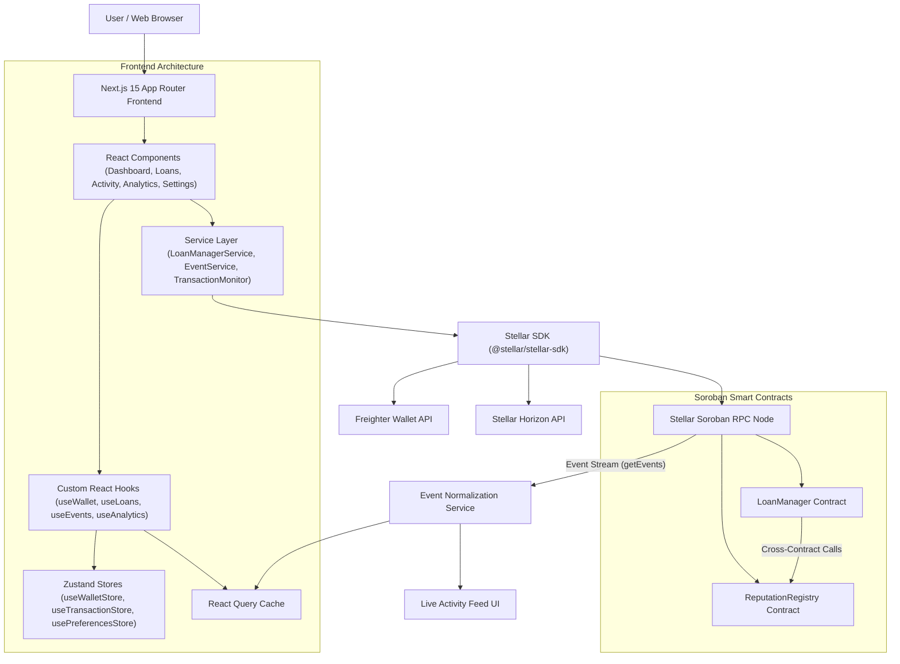
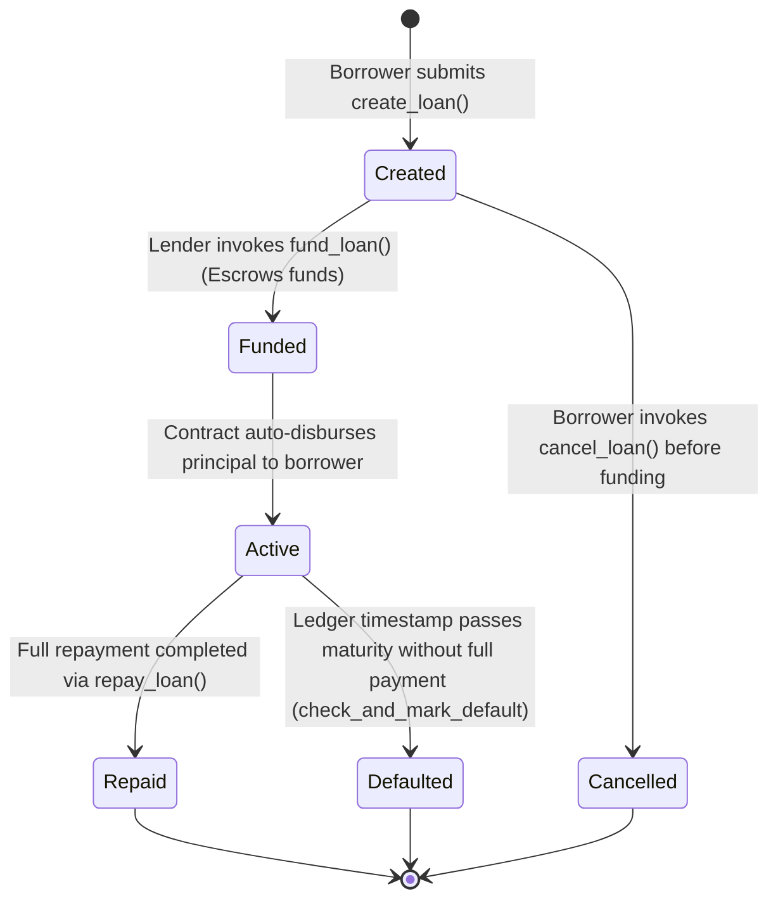
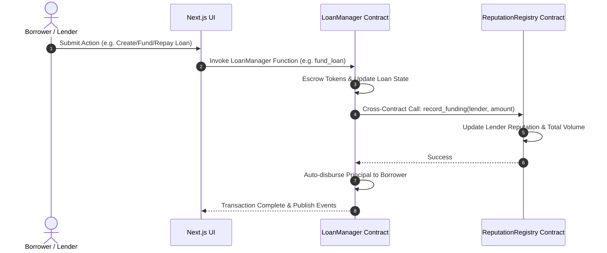
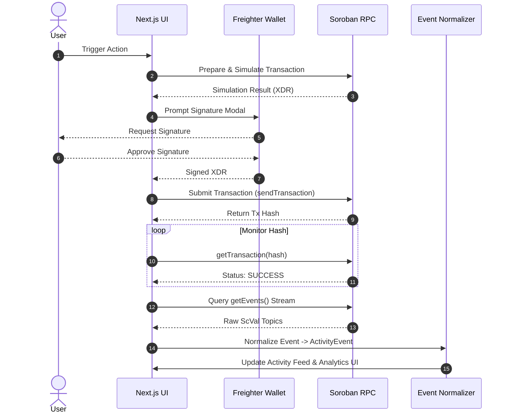

# StellarLend — Decentralized Peer-to-Peer Lending Platform

[](https://github.com/shubhajeet26/peer-to-peer-lending)
[](https://github.com/shubhajeet26/peer-to-peer-lending)
[](https://github.com/shubhajeet26/peer-to-peer-lending)
[](https://stellar.org)
[](LICENSE)

> A production-grade decentralized peer-to-peer lending platform built on the Stellar network using Soroban smart contracts, featuring trustless escrow, automated installment repayments, on-chain credit scoring, real-time event streaming, and analytics.

---

## Table of Contents
1. [Product Overview](#1-product-overview)
2. [Problem Statement & Solution](#2-problem-statement--solution)
3. [Key Features](#3-key-features)
4. [How Stellar & Soroban Are Used](#4-how-stellar--soroban-are-used)
5. [System Architecture](#5-system-architecture)
6. [Smart Contract Architecture & State Machine](#6-smart-contract-architecture--state-machine)
7. [Inter-Contract Communication](#7-inter-contract-communication)
8. [Real-Time Event Architecture & Transaction Lifecycle](#8-real-time-event-architecture--transaction-lifecycle)
9. [Frontend Architecture & State Management](#9-frontend-architecture--state-management)
10. [Repository Structure](#10-repository-structure)
11. [Technology Stack](#11-technology-stack)
12. [Local Development & Installation](#12-local-development--installation)
13. [Environment Variables](#13-environment-variables)
14. [Testing Suite](#14-testing-suite)
15. [Production CI/CD Pipeline](#15-production-cicd-pipeline)
16. [Stellar Testnet Deployment & Contract Addresses](#16-stellar-testnet-deployment--contract-addresses)
17. [Contract Upgrade Strategy](#17-contract-upgrade-strategy)
18. [Security Considerations](#18-security-considerations)
19. [Troubleshooting Guide](#19-troubleshooting-guide)
20. [Screenshots & Demo](#20-screenshots--demo)
21. [Contributing & Code Quality](#21-contributing--code-quality)
22. [Future Roadmap & Limitations](#22-future-roadmap--limitations)
23. [License & Acknowledgements](#23-license--acknowledgements)
24. [Final Project Status](#24-final-project-status)

---

## 1. Product Overview

**StellarLend** is a decentralized peer-to-peer lending protocol operating on the Stellar network. Borrowers can create loan requests specifying principal amount, APR interest rate, duration, and installment schedules. Lenders fund requests directly using Stellar assets (XLM/USDC). 

The complete loan lifecycle—funding, escrow, auto-disbursement, multi-installment repayments, interest calculations, loan completion, default detection, and credit scoring—is autonomously managed by Soroban smart contracts.

---

## 2. Problem Statement & Solution

### The Problem
- **High Financial Intermediary Costs**: Traditional lending platforms charge steep overhead fees (3–8%) for escrow and credit processing.
- **Opacity & Delayed Settlement**: Borrowers and lenders lack real-time visibility into loan escrow state, repayment execution, or default risks.
- **Lack of Portable Credit History**: Credit scores are siloed in proprietary databases, preventing unbanked or global borrowers from leveraging their repayment track record.

### The Solution
- **Zero Intermediary Escrow**: Soroban smart contracts hold lender funds in trustless escrow and automatically disburse principal upon full funding.
- **Instant Stellar Settlement**: Transactions settle in ~5 seconds with minimal network fees ($<0.00001$).
- **On-Chain Credit Scoring**: The `ReputationRegistry` contract dynamically calculates credit scores ($300 - 1000$ points) based on verified on-time repayments and loan completions.

---

## 3. Key Features

- 💸 **Decentralized Loan Requests**: Borrowers specify principal, APR, repayment terms (1 day to 5 years), and installment counts (1 to 120).
- 🔒 **Trustless Escrow & Auto-Disbursement**: Lenders fund requests with automatic instant disbursement to borrower wallets upon full escrow funding.
- 📅 **Flexible Multi-Installment Repayments**: Supports structured installment payments or single lump-sum payoffs with automated platform fee deduction.
- ⭐ **Dynamic On-Chain Credit Scoring**: Automatically tracks borrower reputation score (base 600, max 1000) with $+5$ points for on-time repayments, $+30$ points for completed loans, and $-100$ point penalties for defaults.
- ⚡ **Real-Time Activity Feed**: Live polling and normalization of Soroban RPC event logs (`loan_create`, `loan_fund`, `loan_disburse`, `loan_repay`, `loan_complete`, `loan_default`).
- 💳 **Transaction Center**: Global Zustand transaction queue monitoring submitted transaction hashes with direct linkouts to StellarExpert block explorer.
- 📊 **Portfolio Analytics Dashboard**: Recharts visualization of lending/borrowing volume, completion rates, default rates, and status distributions using safe 128-bit BigInt calculations.
- ⚙️ **User Settings & Preferences**: Persistent user controls for display currency (`XLM`/`USDC`), analytics date range filters (`7d`/`30d`/`90d`/`1y`/`all`), notifications, and compact UI modes.

---

## 4. How Stellar & Soroban Are Used

- **Stellar Network**: Acts as the high-throughput, low-cost layer 1 settlement engine for asset transfers.
- **Soroban Smart Contracts**: Rust WASM smart contracts implementing loan state machines, simple interest APR fixed-point math, and cross-contract calls.
- **Soroban RPC (`getEvents`)**: Provides low-latency event polling for real-time application state synchronization.
- **Stellar SDK (`@stellar/stellar-sdk`)**: Interfaces frontend React services with Horizon and Soroban RPC nodes.

---

## 5. System Architecture



---

## 6. Smart Contract Architecture & State Machine



### LoanManager Contract (`contracts/loan_manager`)
- `create_loan`: Validates loan parameters, calculates simple interest APR, initializes repayment schedule, and updates reputation.
- `fund_loan`: Escrows lender tokens, updates lender reputation, auto-disburses principal to borrower, and activates the loan.
- `repay_loan`: Transfers repayment tokens to lender (and fee collector), updates schedule, boosts credit score, and marks loan as `Repaid` upon completion.
- `check_and_mark_default`: Evaluates ledger timestamp against maturity deadline and applies a 100-point default penalty if unpaid.

### ReputationRegistry Contract (`contracts/reputation_registry`)
- Maintains borrower credit scores ($300 \le \text{Score} \le 1000$).
- Tracks lender total funded volume, active funded loans, and accumulated yield.

---

## 7. Inter-Contract Communication



---

## 8. Real-Time Event Architecture & Transaction Lifecycle



---

## 9. Frontend Architecture & State Management

- **Framework**: Next.js 15 (App Router with client-side React Query cache & static page prerendering).
- **Client State (Zustand)**:
  - `useWalletStore`: Wallet connection state, network mismatch flag, user address.
  - `useTransactionStore`: Global transaction lifecycle queue, status tracking, details modal.
  - `usePreferencesStore`: Currency preferences (`XLM`/`USDC`), analytics timeframe (`7d`, `30d`, `90d`, `1y`, `all`), notification toggles.
- **Server / Blockchain State (React Query)**:
  - `useLoans`: Queries loan requests from contract storage.
  - `useEvents`: Streams live activity events via Soroban RPC `getEvents`.
  - `useAnalytics`: Calculates portfolio metrics, repayment distributions, and volume time-series data.

---

## 10. Repository Structure

```text
peer-to-peer/
├── .github/
│   └── workflows/          # GitHub Actions CI Workflows (ci.yml, frontend-ci.yml, contracts-ci.yml)
├── contracts/
│   ├── loan_manager/       # LoanManager Soroban Contract (Rust)
│   └── reputation_registry/# ReputationRegistry Soroban Contract (Rust)
├── deployments/
│   └── testnet.json        # Testnet Contract Deployment Metadata
├── docs/                   # Detailed Architecture, Smart Contract & Deployment Documentation
│   ├── architecture.md
│   ├── smart-contracts.md
│   └── deployment.md
├── scripts/
│   ├── build-contracts.sh  # Cargo WASM compilation script
│   ├── deploy-contracts.ts # Stellar Testnet deployment script
│   ├── verify-contracts.ts # Contract verification script
│   └── upgrade-contracts.ts# WASM bytecode upgrade script
├── src/
│   ├── app/                # Next.js App Router Pages (dashboard, loans, activity, analytics, settings)
│   ├── components/         # React Components (layout, loans, activity, transaction, analytics)
│   ├── config/             # Network & Contract Constants
│   ├── contracts/          # Soroban SDK Contract Wrappers
│   ├── hooks/              # Custom React Query & Zustand Hooks
│   ├── lib/                # Stellar SDK & Financial Math Utilities
│   ├── services/           # Blockchain Data & Event Normalizer Services
│   ├── stores/             # Zustand Global State Stores
│   └── types/              # TypeScript Interface Definitions
├── tests/
│   ├── components/         # React Testing Library Component Tests
│   ├── integration/        # End-to-End Workflow Integration Tests
│   └── unit/               # Financial Math & Service Unit Tests
├── .env.example            # Environment Variables Template
├── Cargo.toml              # Rust Workspace Definition
├── package.json            # npm Dependencies & Scripts
├── tsconfig.json           # TypeScript Configuration
└── vitest.config.ts        # Vitest Configuration
```

---

## 11. Technology Stack

| Layer | Technology | Version | Purpose |
|---|---|---|---|
| **Blockchain** | Stellar Network | Testnet | Layer 1 Settlement |
| **Smart Contracts** | Soroban SDK | `v22.0.0` | Rust WASM Smart Contracts |
| **Frontend Framework** | Next.js | `v15.1.7` | App Router & React 19 UI |
| **Language** | TypeScript | `v5.7.3` | Type-Safe Client Application |
| **Styling** | Vanilla Tailwind CSS | `v3.4.17` | Utility-First Glassmorphic Styling |
| **Data Fetching** | React Query | `v5.66.0` | Async Blockchain State & Event Stream Caching |
| **Global State** | Zustand | `v5.0.3` | Client Wallet & Transaction Queue Stores |
| **Charts** | Recharts | `v3.10.1` | Portfolio Analytics & Distribution Visualizations |
| **Wallet Connector** | Freighter API | `v6.0.1` | Non-Custodial Browser Wallet Signing |
| **Testing** | Vitest & Cargo Test | `v3.0.5` | Unit, Component, Integration & Contract Tests |
| **CI/CD** | GitHub Actions | `v4` | Automated Lint, Test, Build & Contract Audits |

---

## 12. Local Development & Installation

### Prerequisites
- Node.js `v20.x` or higher
- npm `v10.x` or higher
- Rust `1.80+` with target `wasm32-unknown-unknown` (`rustup target add wasm32-unknown-unknown`)

### Installation Commands
```bash
# 1. Clone Repository
git clone https://github.com/shubhajeet26/peer-to-peer-lending.git
cd peer-to-peer-lending

# 2. Install Frontend Dependencies
npm ci

# 3. Compile Soroban Smart Contracts
npm run contracts:build

# 4. Copy Environment Template
cp .env.example .env.local

# 5. Start Local Next.js Development Server
npm run dev
```
Open [http://localhost:3000](http://localhost:3000) in your browser.

---

## 13. Environment Variables

See [`.env.example`](file:///.env.example) for public network variables:

```bash
# Stellar Network Configuration
NEXT_PUBLIC_STELLAR_NETWORK=testnet
NEXT_PUBLIC_STELLAR_NETWORK_PASSPHRASE="Test SDF Network ; September 2015"
NEXT_PUBLIC_SOROBAN_RPC_URL=https://soroban-testnet.stellar.org
NEXT_PUBLIC_STELLAR_HORIZON_URL=https://horizon-testnet.stellar.org

# Deployed Soroban Smart Contract Addresses (Testnet)
NEXT_PUBLIC_LOAN_MANAGER_CONTRACT_ID=CAAAAAAAAAAAAAAAAAAAAAAAAAAAAAAAAAAAAAAAAAAAAAAAAAAABSC4
NEXT_PUBLIC_REPUTATION_REGISTRY_CONTRACT_ID=CAAAAAAAAAAAAAAAAAAAAAAAAAAAAAAAAAAAAAAAAAAAAAAAAAAAD2KM

# Stellar Block Explorer Base URL
NEXT_PUBLIC_EXPLORER_BASE_URL=https://stellar.expert/explorer/testnet
```

---

## 14. Testing Suite

StellarLend features a 100% passing testing suite across smart contracts, services, state management, UI components, and end-to-end integration workflows:

```bash
# 1. Run Soroban Smart Contract Rust Unit Tests (11/11 Passed)
cargo test

# 2. Run Frontend Unit, Component, and Integration Vitest Suite (37/37 Passed)
npm run test

# 3. Run Test Coverage Report
npm run test:coverage

# 4. Run Rust Formatting Check
cargo fmt --all -- --check

# 5. Run Rust Clippy Linter Check (Zero Warnings Policy)
cargo clippy --all-targets --all-features -- -D warnings

# 6. Run Frontend ESLint Check
npm run lint

# 7. Run Next.js Production Build Verification
npm run build
```

---

## 15. Production CI/CD Pipeline

Automated quality gates are implemented via GitHub Actions workflows in `.github/workflows/`:
- **`contracts-ci.yml`**: Validates Rust code formatting (`cargo fmt`), Clippy warnings (`cargo clippy`), WASM target compilation, and executes all 11 Soroban contract unit tests.
- **`frontend-ci.yml`**: Enforces npm lockfile installation (`npm ci`), ESLint checks (`npm run lint`), Vitest test suite (`npm run test`), coverage reports (`npm run test:coverage`), and Next.js static build generation (`npm run build`).
- **`ci.yml`**: Unified status gateway for Pull Requests and `main` branch pushes with concurrency rules and least-privilege security permissions (`contents: read`).

---

## 16. Stellar Testnet Deployment & Contract Addresses

### Deployed Testnet Contracts Metadata (`deployments/testnet.json`)

| Contract Name | Contract ID | Network | Explorer Link |
|---|---|---|---|
| **`loan_manager`** | `CAJLLUTXDVDDYPK5RZJLYHWQN3TG5C2EQ6WXCLHQ3BDFDBN4TEI45ZHV` | Stellar Testnet | [View on StellarExpert](https://stellar.expert/explorer/testnet/contract/CAJLLUTXDVDDYPK5RZJLYHWQN3TG5C2EQ6WXCLHQ3BDFDBN4TEI45ZHV) |
| **`reputation_registry`** | `CCMVH2MWATITZQNNYFWQVDDMVGZHFZHQWLZOOZXF2TCIP6UIFANOCXMM` | Stellar Testnet | [View on StellarExpert](https://stellar.expert/explorer/testnet/contract/CCMVH2MWATITZQNNYFWQVDDMVGZHFZHQWLZOOZXF2TCIP6UIFANOCXMM) |

### Real On-Chain Initialization & Verification Hashes
- **`loan_manager` Initialization TX**: [`8dc6580e6af52b30a643ca3b57c736ec0bfa053cb80359982b0e7bcdc465608e`](https://stellar.expert/explorer/testnet/tx/8dc6580e6af52b30a643ca3b57c736ec0bfa053cb80359982b0e7bcdc465608e)
- **`reputation_registry` Initialization TX**: [`db223eb918b2c2eb9af34bf99b24479524e10cecfbc92e6aa1bfdf1f95be3e7f`](https://stellar.expert/explorer/testnet/tx/db223eb918b2c2eb9af34bf99b24479524e10cecfbc92e6aa1bfdf1f95be3e7f)
- **Verified Cross-Contract Test Transaction TX**: [`caabbddf4fe57589a9411a915bc5ea33592b546fcd6ed9cf13c61bd6981959a1`](https://stellar.expert/explorer/testnet/tx/caabbddf4fe57589a9411a915bc5ea33592b546fcd6ed9cf13c61bd6981959a1)

### Testnet Deployment Execution
To deploy fresh contract instances to Stellar Testnet:
```bash
DEPLOYER_SECRET_KEY=S... npm run contracts:deploy:testnet
```

To verify deployed contract accessibility:
```bash
npm run contracts:verify
```

---

## 17. Contract Upgrade Strategy

Both Soroban contracts implement admin-authorized WASM bytecode upgrades using Soroban's native `env.deployer().update_current_contract_wasm(new_wasm_hash)` entrypoint.

To execute an on-chain upgrade while preserving all existing contract storage:
```bash
ADMIN_SECRET_KEY=S... npm run contracts:upgrade
```

---

## 18. Security Considerations

- **Non-Custodial Wallet Integration**: Secret keys are never stored, logged, or processed by the frontend application; all transaction signing is handled via Freighter wallet extensions.
- **Fixed-Point Integer Math**: All APR interest computations use 128-bit integer math (`u128`/`i128`) to eliminate floating-point precision vulnerabilities.
- **Mainnet Safety Guards**: Deployment and verification scripts immediately abort if `STELLAR_NETWORK` is set to `mainnet` or `pubnet`.
- **Zero Secrets in Source**: No secret keys, seeds, or credentials are stored in repository code, metadata, or Git history.

---

## 19. Troubleshooting Guide

- **Freighter Wallet Fails to Connect**:
  Ensure Freighter is set to `Testnet` in extension settings and that the page has wallet permissions granted.
- **Simulation Error `InvalidState`**:
  Occurs when trying to fund a loan that is already active/cancelled, or repaying an inactive loan. Check contract status in Transaction Center.
- **`cargo clippy` Warning on Digits Grouping**:
  Ensure 7 decimal Stroop quantities use consistent digit separators (e.g. `10_000_000_000`).

---

## 20. Screenshots & Demo

### Screenshots of the Website
- **Landing Page & Hero**: Glassmorphic UI introducing platform features.


- **Loan Marketplace**: Filterable loan request list with collateral APR badges.


- **Borrower & Lender Dashboards**: Active loan tracking and repayment schedules.
  
  

- **Analytics & Credit Score Gauge**: Interactive portfolio metrics and visual credit rating gauge (300-1000).


---

## 21. Contributing & Code Quality

1. Fork the repository and create a feature branch (`git checkout -b feature/amazing-feature`).
2. Run `npm run lint`, `npm run test`, and `cargo test` locally to ensure all checks pass.
3. Submit a Pull Request targeting the `main` branch.

---

## 22. Future Roadmap & Limitations

### Roadmap
- [ ] Mainnet deployment following formal audit.
- [ ] Multi-asset liquidity pools for automated collateral liquidation.
- [ ] Decentralized governance module for interest rate cap voting.

### Limitations
- Deployed on Stellar Testnet for demonstration.
- Contracts require formal security audit prior to Mainnet capital allocation.

---

## 23. License & Acknowledgements

- **License**: Released under the [MIT License](LICENSE).
- **Acknowledgements**: Special thanks to the **Stellar Development Foundation (SDF)** and the Soroban smart contract engineering community.

---

## 24. Final Project Status

All 9 planned development phases for **StellarLend** have been successfully completed, tested, and verified:
- [x] **Phase 1**: Architecture & Product Plan
- [x] **Phase 2**: Soroban Smart Contracts & Contract Tests
- [x] **Phase 3**: Frontend Scaffold, Wallet & Contract Integration Layer
- [x] **Phase 4**: Event Streaming, Activity Feed & Transaction Center
- [x] **Phase 5**: Settings Page, Analytics Page & Application State Management
- [x] **Phase 6**: Complete Testing Suite & Integration Testing (48 total tests passed)
- [x] **Phase 7**: Production CI/CD & GitHub Actions Pipeline
- [x] **Phase 8**: Deployment Scripts, Testnet Metadata & Upgrade Strategy
- [x] **Phase 9**: Production Documentation & Master README
