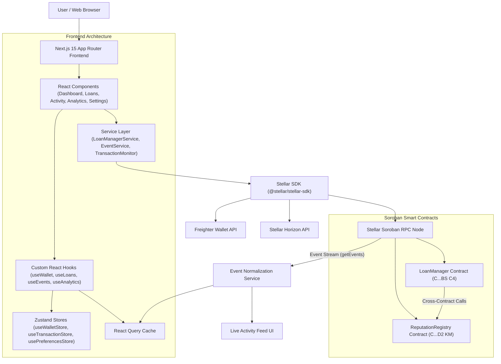
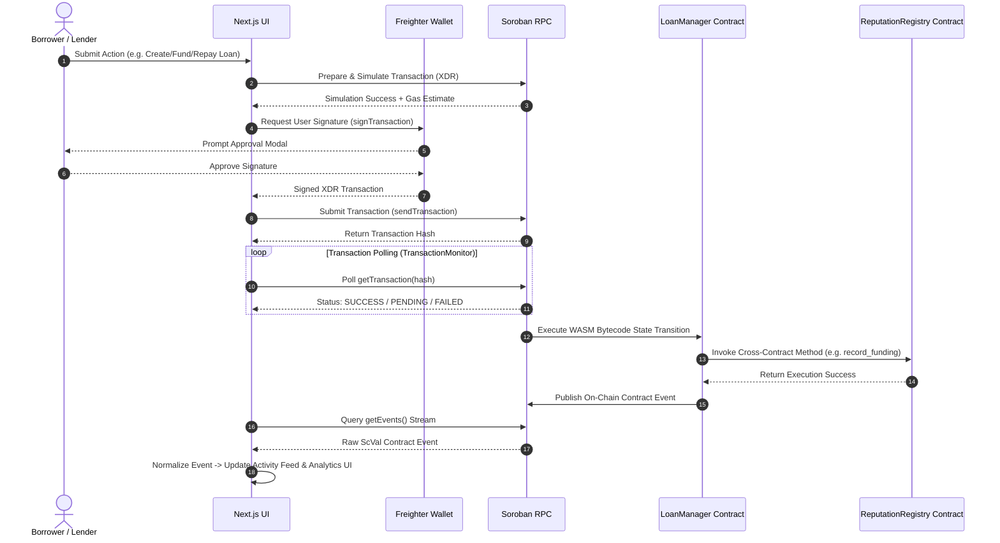

# StellarLend — Architecture & Data Flow Specification

This document provides a comprehensive technical overview of the system architecture, data flow, transaction lifecycle, and component interactions in **StellarLend**.

---

## 1. High-Level Architecture Diagram



---

## 2. Component Layering & System Responsibilities

### 2.1 Web Frontend Layer
- **Framework**: Next.js 15 (App Router with SSR static rendering and client components).
- **Styling**: Vanilla Tailwind CSS v3 with glassmorphism design tokens, CSS custom properties, and dark mode palette tailored for financial applications.
- **State Management**:
  - **Zustand**: Client state for active wallet connection (`useWalletStore`), transaction lifecycle queue & tracking modals (`useTransactionStore`), and display currency / notification settings (`usePreferencesStore`).
  - **React Query**: Async blockchain cache for smart contract reads, loan registries, live activity streams, and portfolio analytics metrics.

### 2.2 Blockchain Service Layer
- **Stellar SDK**: Interacts with Soroban RPC nodes (`getEvents`, `simulateTransaction`, `sendTransaction`, `getTransaction`).
- **Freighter Wallet Adapter**: Solicits ed25519 user signatures for Soroban contract invocations without exposing secret keys.
- **Event Normalizer Service**: Decodes Soroban `ScVal` contract topics into strongly typed `ActivityEvent` structures.

### 2.3 Soroban Smart Contract Layer
- **`loan_manager`**: Escrows lender funds, enforces interest APR math, manages auto-disbursements to borrowers, processes multi-installment repayments, monitors default deadlines, and executes cross-contract reputation updates.
- **`reputation_registry`**: Maintains on-chain borrower credit scores ($300 - 1000$ range), completed loan histories, default penalties, and lender yield statistics.

---

## 3. Transaction & Event Lifecycle Sequence



---

## 4. Contract Upgrade Architecture

Both Soroban contracts implement admin-authorized WASM bytecode upgrades using Soroban's native `env.deployer().update_current_contract_wasm(new_wasm_hash)` entrypoint.

```mermaid
graph LR
    Admin["Contract Admin Key"] -->|1. Sign Upgrade Tx| UpgradeScript["scripts/upgrade-contracts.ts"]
    WASM["New WASM Bytecode"] -->|2. Compute Hash| UpgradeScript
    UpgradeScript -->|3. Invoke upgrade(env, hash)| Contract["Target Soroban Contract"]
    Contract -->|4. update_current_contract_wasm| Storage["Contract Storage & State (Preserved)"]
```

State stored in persistent storage slots remains completely intact under the updated contract code version.
