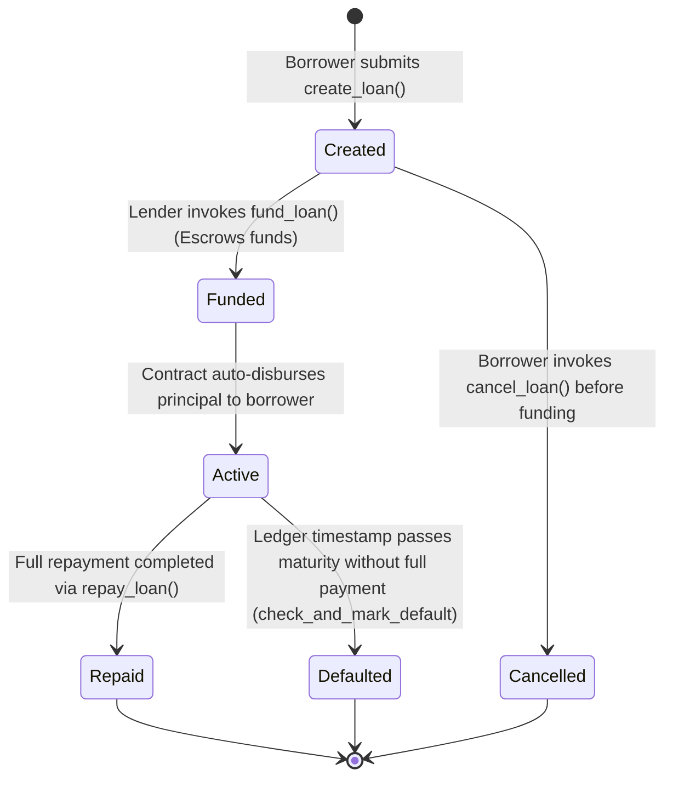

# StellarLend — Soroban Smart Contracts Reference

This document details the smart contract specifications, API interfaces, storage schemas, state machines, and mathematical formulas implemented in **StellarLend** using Soroban Rust SDK v22.

---

## 1. Loan Lifecycle State Machine

---

## 2. LoanManager Contract (`contracts/loan_manager`)

### 2.1 Overview
The `LoanManager` contract serves as the financial escrow engine of StellarLend. It manages loan creation, lender funding, principal auto-disbursement, interest calculation, multi-installment repayment schedules, and default enforcement.

### 2.2 Public Entrypoints

| Function | Parameters | Access Control | Description |
|---|---|---|---|
| `initialize` | `admin`, `reputation_contract`, `platform_fee_bps`, `fee_collector` | Admin Auth | Initializes contract configuration and admin key. |
| `create_loan` | `borrower`, `token`, `principal`, `interest_rate_bps`, `duration_seconds`, `total_installments`, `purpose_hash` | Borrower Auth | Creates a new loan request, computes interest & schedule, and updates reputation. |
| `cancel_loan` | `loan_id`, `borrower` | Borrower Auth | Cancels an unfunded loan request. |
| `fund_loan` | `loan_id`, `lender` | Lender Auth | Escrows lender tokens, updates reputation, auto-disburses principal to borrower, and activates loan. |
| `repay_loan` | `loan_id`, `payer`, `amount` | Payer Auth | Submits repayment, handles optional platform fee, updates schedule & reputation score. |
| `check_and_mark_default` | `loan_id`, `caller` | Caller Auth | Verifies maturity deadline overflow, marks loan as `Defaulted`, and applies 100pt score penalty. |
| `upgrade` | `new_wasm_hash` | Admin Auth | Updates contract WASM bytecode via `env.deployer().update_current_contract_wasm`. |

### 2.3 Financial Interest Math Formula

Simple interest APR is computed using 128-bit fixed-point integer math to prevent precision loss or overflow:

$$\text{InterestAmount} = \left\lfloor \frac{\text{Principal} \times \text{InterestRateBps} \times \text{DurationSeconds}}{10,000 \times 31,536,000} \right\rfloor$$

$$\text{TotalRepaymentAmount} = \text{Principal} + \text{InterestAmount}$$

---

## 3. ReputationRegistry Contract (`contracts/reputation_registry`)

### 3.1 Overview
The `ReputationRegistry` contract stores on-chain borrower credit scores and lender yield statistics.

### 3.2 Credit Score Scoring Rules

- **Initial Credit Score**: `600` points.
- **Credit Score Bounds**: Clamped between `300` (min) and `1000` (max).
- **On-Time Repayment Boost**: `+5` points per on-time installment.
- **Loan Completion Boost**: `+30` points on full loan repayment.
- **Default Penalty**: `-100` points per defaulted loan.

---

## 4. Contract Error Codes

### `LoanError` (LoanManager)
- `AlreadyInitialized` (1): Contract has already been initialized.
- `Unauthorized` (2): Caller signature does not match authorized address.
- `InvalidAmount` (3): Invalid principal or repayment amount.
- `InvalidInterestRate` (4): Interest rate is 0 or exceeds 100% (10,000 BPS).
- `InvalidDuration` (5): Loan duration outside allowed bounds (1 day to 5 years).
- `InvalidInstallments` (6): Installments count is 0 or exceeds 120.
- `LoanNotFound` (7): Specified Loan ID does not exist.
- `InvalidState` (8): Operation invalid for current loan status.
- `OverpaymentNotAllowed` (9): Repayment amount exceeds remaining total obligation.
- `RepaymentDeadlineNotPassed` (10): Cannot mark default before maturity timestamp.

### `ReputationError` (ReputationRegistry)
- `AlreadyInitialized` (1): Contract has already been initialized.
- `Unauthorized` (2): Caller is not the authorized LoanManager contract or Admin.
- `InvalidScore` (3): Score value out of valid bounds.
